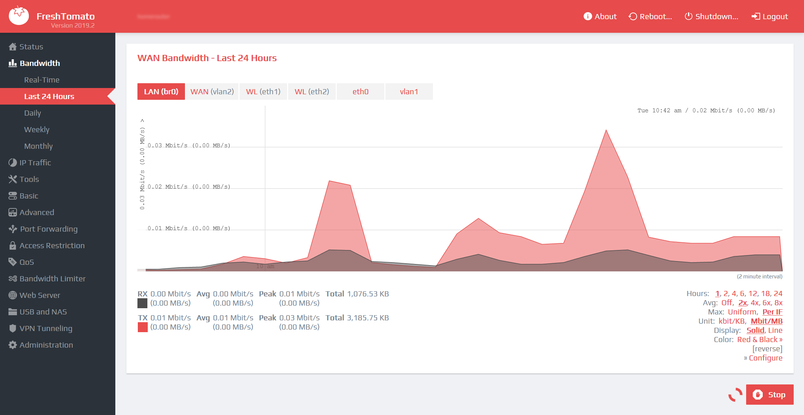

This is a fork from [tsg2k2's custom css](https://github.com/tsg2k2/tomato-css) ported to userstyle.

It's an attempt to re-implement AdvancedTomato's look and feel on vanilla Tomato firmware (i.e. css only). Includes 
* uniform panel-based UI
* custom-drawn controls 
* svg-based icons in main menu, on all buttons, and some panel titles (embedded, no external dependencies)
* uniform alignment and indents across all the pages. 
* uniform text styles
* multi-column for wide monitors (WiP)
* css-only animation for spinners
* parametrized to make different accent color easy to apply, etc. 

Tampermonkey (, ) scripts provided:
 *  to make graphs dynamically resizable.  
 * [script](https://github.com/tsg2k2/tomato-css/raw/master/release/FreshTomatoProgressBarEnabler.user.js) to add dynamically updated graphs on the overview page. Note that only https://192.168.1.1/ or http://freshtomato/ are enabled by default

## Installation

Open Stylus manager, click on cog icon to customize it 

## Screenshots

Light Theme - Default - Overview

Light Theme - Blue - Basic

Light Theme - Red - Graphs

