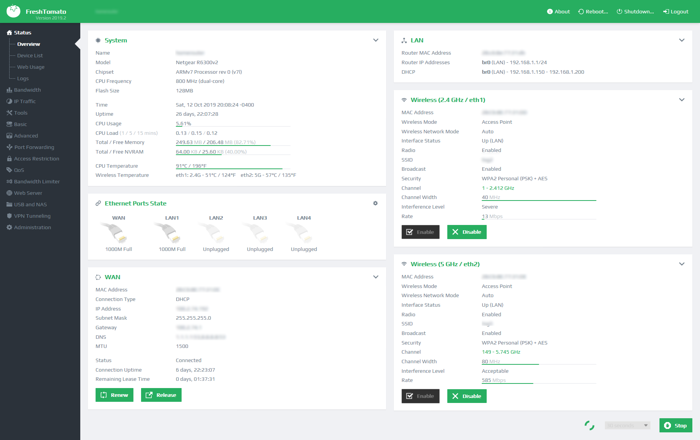
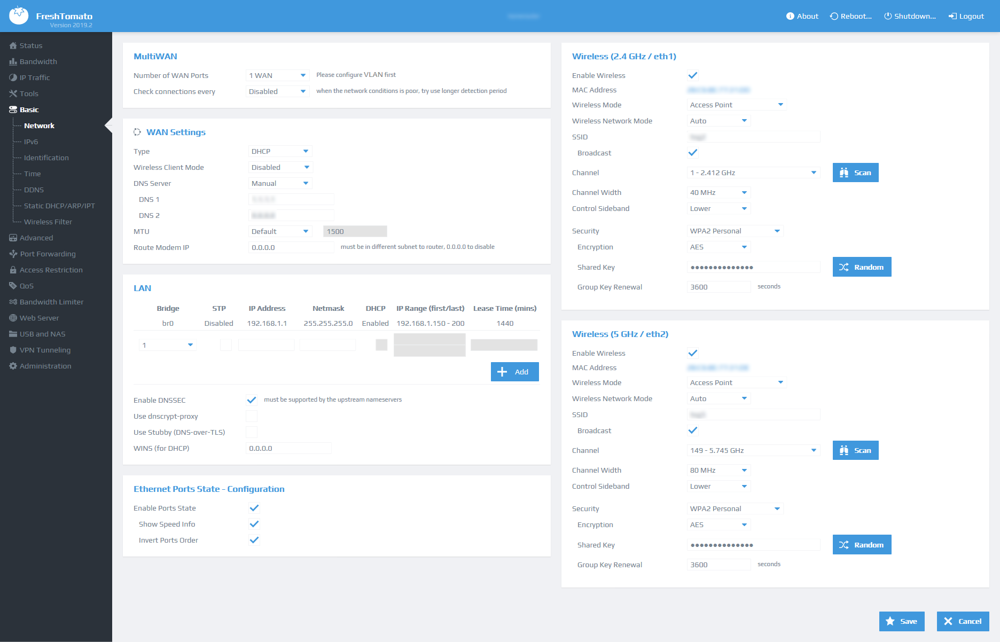

 

  

  <h3 align="center">Tomato-css Userstyle</h3>

## Table of Contents

* [Description](#description)
* [Getting Started](#getting-started)
  * [Prerequisites](#prerequisites)
  * [Installation](#installation)
  * [Dynamic Graphs](#dynamic-graphs)
* [Usage](#usage)  
* [Differences between Usertyle and custom.css](#differences-between-usertyle-and-customcss)
* [Screenshots](#screenshots)

## Description
**Tomato-css Userstyle** is a fork from [tsg2k2's custom css][custom-css] ported to userstyle.  
Tomato-css Userstyle shares the same code of [tsg2k2's custom css][custom-css] with the option for customization using [Stylus browser extension][stylus]  

It's an attempt to re-implement AdvancedTomato's look and feel on vanilla Tomato firmware (i.e. css only). Includes 
* uniform panel-based UI
* custom-drawn controls 
* svg-based icons in main menu, on all buttons, and some panel titles (embedded, no external dependencies)
* uniform alignment and indents across all the pages. 
* uniform text styles
* multi-column for wide monitors (WiP)
* css-only animation for spinners
* parametrized to make different accent color easy to apply, etc. 

[custom-css]: https://github.com/tsg2k2/tomato-css

## Getting Started

### Prerequisites
* Stylus
  * [![Firefox][StylusFirefoxBadge]](https://addons.mozilla.org/firefox/addon/styl-us/)
  * [![Google Chrome][StylusChromeBadge]](https://chrome.google.com/webstore/detail/stylus/clngdbkpkpeebahjckkjfobafhncgmne)
  
 [StylusFirefoxBadge]: https://img.shields.io/amo/v/styl-us?color=orange&label=Firefox%20add-on
 [StylusChromeBadge]: https://img.shields.io/chrome-web-store/v/clngdbkpkpeebahjckkjfobafhncgmne

### Installation

[![Install directly with Stylus][badge]][style]  

[badge]: https://img.shields.io/badge/Install%20directly%20with-Stylus-116b59.svg?longCache=true&style=for-the-badge
[style]: https://raw.githubusercontent.com/Generator/tomato-css-userstyle/userstyle/tomato.user.css

[stylus]:https://github.com/openstyles/stylus/#releases

### Dynamic Graphs
Tampermonkey (, ) scripts provided:
 *  to make graphs dynamically resizable.  
 * [script](https://github.com/tsg2k2/tomato-css/raw/master/release/FreshTomatoProgressBarEnabler.user.js) to add dynamically updated graphs on the overview page. Note that only https://192.168.1.1/ or http://freshtomato/ are enabled by default

## Usage
Open **Stylus manager**, click on cog icon to customize it 

## Differences between Usertyle and custom.css

| Feature                  | Usertyle | custom.css  |
|--------------------------|:--------:|:-----------:|
| Custom Colors            | ✔️       | ❌          |
| Live Changes             | ✔️       | ❌          |
| Any Browser/Device [1]  | ❌       | ✔️          | 
| Multi Router/Domain [2] | ✔️       | ❌          | 

[1]: Only available on installed browser  
[2]: custom.css needs to be manually installed on every router

## Screenshots

Light Theme - Default - Overview

Light Theme - Blue - Basic

Light Theme - Red - Graphs

